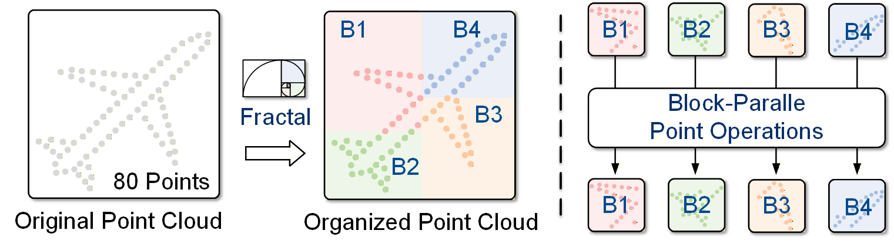
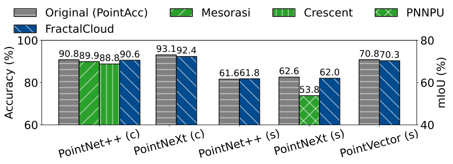

# FractalCloud

Official PyTorch implementation for the HPCA'26 paper:

**FractalCloud: A Fractal-Inspired Architecture for  Efficient Large-Scale Point Cloud Processing**

*by [Yuzhe Fu](https://yuzhe-fu.github.io), [Changchun Zhou](https://changchun-zhou.github.io), [Hancheng Ye](https://hanchengye.com), Bowen Duan, Qiyu Huang, [Chiyue Wei](https://dubcyfor3.github.io), [Cong Guo](https://guocong.me), [Hai “Helen” Li](https://ece.duke.edu/people/hai-helen-li/), [Yiran Chen](https://ece.duke.edu/people/yiran-chen/)*

[[Paper (arXiv)](https://arxiv.org/abs/2511.07665)]

<p align="center">
  
</p>


## Abstract

This repository provides the reference software implementation of **FractalCloud**. FractalCloud introduces a **fractal partitioning algorithm** that decomposes large point clouds into spatially coherent local blocks through a transversal logic, implemented in PyTorch using a **thread-parallel recursive procedure**. On top of this, we design a set of **block-parallel point operations** that fully decompose all point-wise computations into local operators. These operations are executed recursively to ensure **numerical consistency** between the software implementation and the hardware accelerator.

> **Note:** The primary objective of this repository is to validate the **algorithmic correctness** of the proposed design. Therefore, we do not introduce custom GPU kernel optimizations or GPU-specific acceleration.

After installation, this repository allows reproducing the network performance reported in the paper on:

- **Classification:** ModelNet40 (PointNet++, PointNeXt-S)  
- **Segmentation:** S3DIS (PointNet++, PointNeXt-S, PointVector-L)

The figure below summarizes the reproduced model accuracies:

<p align="center">
  
</p>

## Installation

Firstly, please Clone the repository:

```bash
git clone https://github.com/Yuzhe-Fu/FractalCloud.git
cd FractalCloud
```

### Dataset Preparation
To download **ModelNet40** and **S3DIS**, run:
```bash
source download_DS.sh
```

### Environment Setup

We provide two environment setups: Docker (recommended) or local installation.

#### Option 1: Docker (recommended)
We recommend downloading from HuggingFace (fast and stable).
The archive file is approximately 45 GB.

```bash
# Download from HuggingFace (recommended)
wget https://huggingface.co/YuzheFu/FractalCloud/resolve/main/FractalCloud_docker.tar

# Or Download from google drive
gdown --fuzzy https://drive.google.com/file/d/1bjkS6beJeIV8MLgCd0CKbMack_s5fmAt/view?usp=share_link
```

Import the Docker image (make sure docker is installed in your environment):
```bash
docker import FractalCloud_docker.tar fractalcloud_env:base
```

Run the container:
```bash
# Please run this under ./FractalCloud
docker run --name fractalcloud \
  -it --gpus all --shm-size 32G \
  -v $(pwd):/workspace \
  fractalcloud_env:base \
  /bin/bash
```
You may see a `command not found` message in the terminal. This can be safely ignored. The container automatically activates the `openpoints` conda environment with all dependencies installed.

### Option 2: Local installation

We recommend CUDA 11.x (tested with CUDA 11.3). Using unsupported CUDA versions may lead to installation failures. You can verify your CUDA version by running `nvcc --version` before executing the installation script.

Then run:
```bash
source install.sh
```

## Pretrained Models
To download pretrained weights:
```bash
gdown --fuzzy --folder https://drive.google.com/drive/folders/1OOlyQGHXW8NpBIot6KYSG_NkGb3NBX-p?usp=share_link

```

Alternatively, models can be downloaded manually from: [Google Drive link](https://drive.google.com/drive/folders/1OOlyQGHXW8NpBIot6KYSG_NkGb3NBX-p?usp=share_link) and [HuggingFace](https://huggingface.co/YuzheFu/FractalCloud/tree/main/Pretrained_Models).

Please place downloaded checkpoints into their corresponding subfolders under `./Pretrained_Models`

For reference and reproducibility, we also provide the evaluation logs associated with all evaluated models.

## Experiments (Model Accuracy)

All commands should be executed under:
-  `./workspace` (Docker setup), or
- `./FractalCloud` (local installation)

Below we provide example commands for reproducing evaluation results.

#### ModelNet40 Classification (PointNet++)

**Baseline 90.8%** is referenced from Fig. 16 of the *Mesorasi* paper. [[Link](https://ieeexplore.ieee.org/document/9251968)]

**Mesorasi 89.9%** is referenced from Fig. 16 of the *Mesorasi* paper. [[Link](https://ieeexplore.ieee.org/document/9251968)]

**Crescent 88.8%** is referenced from Fig. 13 of the *Crescent* paper. [[Link](https://dl.acm.org/doi/10.1145/3470496.3527395)]
```bash
# Run with Fractal
CUDA_VISIBLE_DEVICES=0 bash script/main_classification.sh \
    cfgs/modelnet40ply2048/pointnet++.yaml \
    mode=test \
    --pretrained_path ./Pretrained_Models/PN++_CLA_fractal/checkpoint/modelnet40_pointnet++_ckpt_best_9056.pth \
    --fractal_stages "0,1" \
    --fractal_th 64
```

#### ModelNet40 Classification (PointNeXt-S)
```bash
# Baseline
CUDA_VISIBLE_DEVICES=0 python examples/classification/main.py \
    --cfg cfgs/modelnet40ply2048/pointnext-s.yaml \
    mode=test \
    --pretrained_path ./Pretrained_Models/PNt_CLA_original/checkpoint/modelnet40_pointnext-s_ckpt_best_9311.pth

# With Fractal
CUDA_VISIBLE_DEVICES=0 python examples/classification/main.py \
    --cfg cfgs/modelnet40ply2048/pointnext-s.yaml \
    mode=test \
    --fractal_stages "1,2" \
    --fractal_th 64 \
    --pretrained_path ./Pretrained_Models/PNT_CLA_fractal/checkpoint/modelnet40_pointnext-s_ckpt_best_9238.pth \
```

#### S3DIS Segmentation (PointNet++)
```bash
# Baseline
CUDA_VISIBLE_DEVICES=0 python examples/segmentation/main.py \
    --cfg cfgs/s3dis/pointnet++.yaml \
    mode=test \
    --pretrained_path ./Pretrained_Models/PN++_SEG_original/checkpoint/s3dis-pointnet++_ckpt_best_616.pth

# With Fractal
CUDA_VISIBLE_DEVICES=0 python examples/segmentation/main.py \
    --cfg cfgs/s3dis/pointnet++.yaml \
    mode=test \
    --fractal_stages "0" \
    --fractal_th 256 \
    --pretrained_path ./Pretrained_Models/PN++_SEG_fractal/checkpoint/s3dis-pointnet++_ckpt_best_618.pth
```

#### S3DIS Segmentation (PointNeXt-S)
```bash
# Baseline
CUDA_VISIBLE_DEVICES=0 bash script/main_segmentation.sh \
    cfgs/s3dis/pointnext-s.yaml \
    wandb.use_wandb=False \
    mode=test \
    --pretrained_path ./Pretrained_Models/PNt_SEG_original/checkpoint/s3dis-pointnext-s_ckpt_best_626.pth

# With Fractal
CUDA_VISIBLE_DEVICES=0 bash script/main_segmentation.sh \
    cfgs/s3dis/pointnext-s.yaml \
    wandb.use_wandb=False \
    mode=test \
    --fractal_stages "1,2" \
    --fractal_th 256 \
    --pretrained_path ./Pretrained_Models/PNt_SEG_fractal/checkpoint/s3dis-pointnext-s_ckpt_best-620.pth
```
**PNNPU 53.8%** is referenced from Table II of the *TCAS-II* paper. [[Link](https://ieeexplore.ieee.org/document/10430381?denied=)]

#### S3DIS Segmentation (PointVector-L)
```bash
# Baseline
CUDA_VISIBLE_DEVICES=0 python examples/segmentation/main.py \
    --cfg cfgs/s3dis/pointvector-l.yaml \
    mode=test \
    --pretrained_path ./Pretrained_Models/PVr_SEG_original/checkpoint/s3dis-pointvector-l_ckpt_best_708.pth

# With Fractal
CUDA_VISIBLE_DEVICES=0 python examples/segmentation/main.py \
    --cfg cfgs/s3dis/pointvector-l.yaml \
    mode=test \
    --fractal_stages "1" \
    --fractal_th 256 \
    --pretrained_path ./Pretrained_Models/PVr_SEG_fractal/checkpoint/s3dis-pointvector-l_ckpt_best_7033.pth
```

## Some Notes:
1. Some frequent commands for docker usage
```bash
exit                               # exit Docker container
docker start fractalcloud          # start container
docker exec -it fractalcloud /bin/bash   # attach interactive shell
docker stop fractalcloud           # stop container
```
2. The `install.sh` in our repo is a simplified version of those from [PointNeXt](https://github.com/guochengqian/PointNeXt), with minimal dependencies tailored for FractalCloud. If you need the full functionality (e.g., running PointTransformer), please install the full environment following the instructions in the [PointNeXt](https://github.com/guochengqian/PointNeXt) repository.

## Citation
If you use this library, please kindly acknowledge our work:
```tex
@article{fu2025fractalcloud,
  title={FractalCloud: A Fractal-Inspired Architecture for Efficient Large-Scale Point Cloud Processing},
  author={Fu, Yuzhe and Zhou, Changchun and Ye, Hancheng and Duan, Bowen and Huang, Qiyu and Wei, Chiyue and Guo, Cong and Li, Hai and Chen, Yiran and others},
  journal={arXiv preprint arXiv:2511.07665},
  year={2025}
}
```

## Acknowledgment

This repository builds upon [OpenPoints](https://github.com/guochengqian/openpoints) and [PointNeXt](https://github.com/guochengqian/PointNeXt). We thank the authors for their open-source contributions.